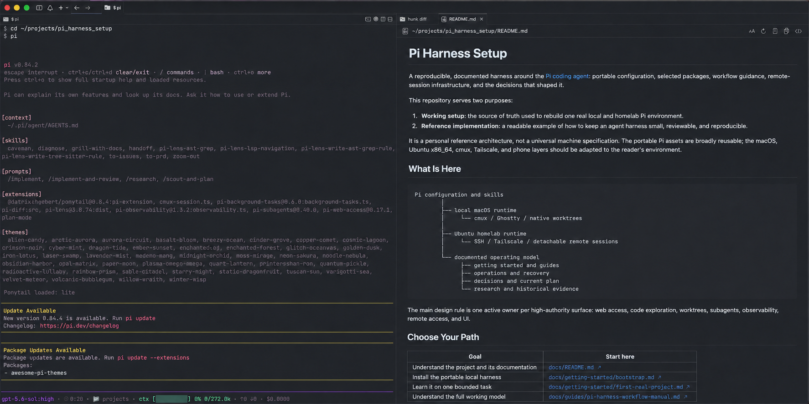
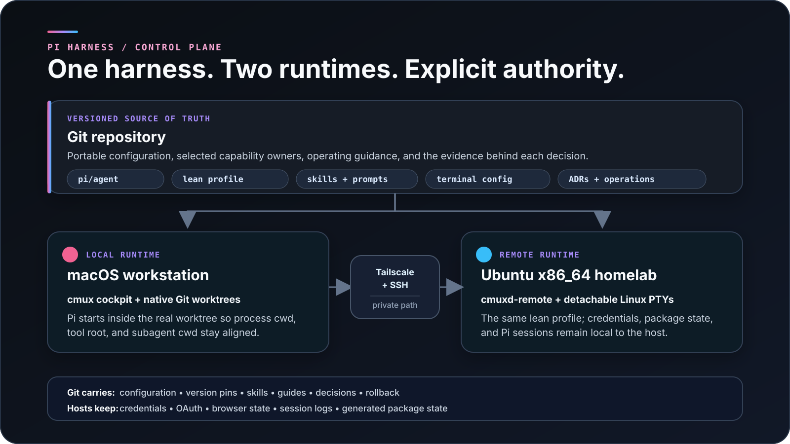

<div align="center">

# Pi Harness

**A reproducible coding-agent control plane built for inspection, remote durability, and deliberate autonomy.**

[](https://github.com/badlogic/pi-mono)  [](docs/decisions/README.md) [](https://github.com/Hong-yiii/pi_harness_setup/commits/main)

</div>



<p align="center"><sub>Pi loading the versioned skills, prompts, and extensions beside the repository that owns them.</sub></p>

Most coding-agent setups slowly become hidden machine state: install a few
plugins, accumulate global instructions, and hope the same behavior exists on
the next machine.

This repository takes the opposite approach. It treats the agent harness as an
engineered system with explicit authority, versioned configuration, private
state boundaries, rollback paths, and recorded evidence. It is both the source
of truth for one real macOS + Ubuntu setup and a reference implementation for
building a coding-agent environment that stays understandable as it gains
power.

> [!NOTE]
> This is a personal reference architecture, not a universal machine
> specification. The portable Pi assets are broadly reusable; the cmux,
> Tailscale, Ubuntu x86_64, homelab, and phone layers should be adapted to the
> reader's environment.

## Why Pi

I chose [Pi](https://github.com/badlogic/pi-mono) because it behaves more like a
small terminal agent runtime than a sealed coding product. Its compact core
leaves the important decisions in this repository:

- which package owns web access, code exploration, delegation, background work,
  and observability;
- which behaviors belong in prompts and which need extension-level enforcement;
- what loads into every interactive session and what runs only as explicit
  automation;
- how local and remote sessions survive transport failures;
- how the same setup is rebuilt without copying credentials or opaque runtime
  state.

The goal is not minimalism for its own sake. It is **bounded authority**: every
high-impact capability should be visible, versioned, testable, and reversible.

## What This Demonstrates

- **Capability governance:** one active owner per high-authority surface, with
  overlapping packages rejected or isolated as trials.
- **Reproducible delivery:** a named package profile and idempotent apply script
  rebuild the portable harness while preserving unrelated user state.
- **Failure-aware concurrency:** native Git worktrees keep Pi, tools, and
  subagents on one real working directory with one writer per lane.
- **Multi-host operations:** macOS is the native cockpit; Ubuntu owns detachable
  remote processes; Tailscale and SSH provide the private control path.
- **Decision hygiene:** research, current policy, ADRs, runbooks, trial evidence,
  and unsettled ideas have distinct homes.
- **Honest validation:** tested behavior and remaining unknowns are recorded
  separately instead of being implied by configuration alone.

## Architecture



The repository carries portable intent. Each host keeps its own credentials,
OAuth state, package installation state, browser data, and live sessions. This
lets the two runtimes converge without turning Git into a secret store or a
machine image.

## Design Rules

| Rule | Why it exists |
| --- | --- |
| Keep upstream Pi as the base | A small, inspectable runtime lets this repo own the behavior. Richer distributions such as OMP remain benchmark lanes until they win on observed workflow and reproducibility. |
| One owner per authority surface | Duplicate web, edit, worktree, orchestration, or status systems create conflicting tools, instructions, and lifecycle state. |
| Keep normal sessions lean | Daily tools can stay ambient; routing loops, retries, budgets, and evals belong in explicit repo-owned automation. |
| Enter the real worktree before starting Pi | Process cwd, Pi context, file tools, artifacts, and child agents resolve the same path. |
| Separate portable intent from host-local state | Configuration and pins travel through Git; credentials, sessions, and generated state do not. |
| Make remote durability a runtime property | The Linux host owns detachable PTYs while the Mac keeps the native workspace, browser, Feed, and notification UI. |
| Review changes in batches | Every meaningful harness change names the affected surface, trust boundary, rollback, and smoke test before implementation. |

## Current Capability Owners

The lean profile deliberately has a small number of named owners:

| Surface | Owner | Boundary |
| --- | --- | --- |
| Agent runtime | upstream Pi `0.83.0` | Small documented base; OMP is a separate trial lane. |
| Web and fetch | `pi-web-access@0.17.1` | Browser-cookie paths stay disabled unless deliberately enabled. |
| Code exploration | `pi-lens@3.8.74` | No competing semantic index or read/edit replacement in the default. |
| Conversational delegation | `pi-subagents@0.40.0` | Bounded scout, research, plan, worker, and review roles. |
| Human-visible status | `pi-observability@1.3.2` | First status layer; no stack of competing sidebars and cost widgets. |
| Background commands | `pi-background-tasks@0.6.0` | Pinned before later releases added unrelated always-on orchestration. |
| Implementation taste | `@dietrichgebert/ponytail@4.8.4` | Runs at `lite`; it does not own research or orchestration. |
| Persistent PR lanes | native Git worktrees + optional `piwt` | One real cwd and one writer per lane. |
| Deterministic loops and evals | code under `automation/` | Explicit invocation only; nothing becomes ambient by existing there. |
| Remote control plane | native `cmux ssh` over Tailscale | Remote tmux and direct SSH/tmux remain break-glass paths. |

The machine-readable profile is
[`pi/package-profiles/lean-default.json`](pi/package-profiles/lean-default.json).

## How A Change Earns Its Place

```text
observe real friction
        ↓
capture it in the current plan
        ↓
name the authority surface and current owner
        ↓
research fit, trust, maturity, install, and rollback
        ↓
implement one reviewed batch
        ↓
smoke-test the real workflow and record what happened
```

This keeps package discovery from becoming a shopping spree and makes rejected
or superseded experiments useful evidence instead of lost context.

## Proven Paths

| Path | Recorded evidence |
| --- | --- |
| Lean user-level package profile and repeatable apply | [ADR 0009](docs/decisions/0009-adopt-lean-default-and-separate-automation.md) and the [package operation](docs/operations/initialize-packages.md) |
| Native worktrees with aligned Pi/tool/subagent cwd | [ADR 0010](docs/decisions/0010-use-native-worktrees-for-pr-lanes.md) |
| Shared harness on an Ubuntu x86_64 homelab | [ADR 0011](docs/decisions/0011-use-shared-harness-with-host-local-linux-runtime.md) and the [rollout record](docs/history/homelab-linux-rollout-plan.md) |
| Native cmux SSH reconnecting to the same remote Pi process | [ADR 0013](docs/decisions/0013-adopt-native-cmux-ssh-as-primary-homelab-control-plane.md) and the [execution log](docs/history/2026-08-27-native-cmux-ssh-pilot.md) |
| Opt-in human review of local changesets | [Hunk guide](docs/guides/hunk.md) |
| Reader-oriented documentation with history kept as evidence | [ADR 0014](docs/decisions/0014-organize-documentation-by-reader-intent.md) |

Still marked `Untested`: full native-app quit/relaunch, Mac sleep/wake, Mosh,
direct iOS-to-Linux use, remote reboot recovery, and a direct rather than relayed
Tailscale path. See [`CONTEXT.md`](CONTEXT.md) and the
[`current plan`](docs/current-plan.md) for the live boundary.

## Choose Your Path

| Goal | Start here |
| --- | --- |
| Understand the project in five minutes | [`docs/README.md`](docs/README.md) |
| Install the portable local harness | [`docs/getting-started/bootstrap.md`](docs/getting-started/bootstrap.md) |
| Learn it on one bounded task | [`docs/getting-started/first-real-project.md`](docs/getting-started/first-real-project.md) |
| Understand the full working model | [`docs/guides/pi-harness-workflow-manual.md`](docs/guides/pi-harness-workflow-manual.md) |
| Use the remote homelab day to day | [`docs/guides/cmux-ssh-remote.md`](docs/guides/cmux-ssh-remote.md) |
| Rebuild the Ubuntu runtime | [`docs/operations/ubuntu-homelab-setup.md`](docs/operations/ubuntu-homelab-setup.md) |
| See current choices and pending work | [`docs/current-plan.md`](docs/current-plan.md) |
| Follow the reasoning behind a choice | [`docs/decisions/README.md`](docs/decisions/README.md) |

## Quick Start

The smallest useful path applies only the portable, user-level Pi harness.
Pi `0.83.0` requires Node `>=22.19.0`.

```bash
git clone https://github.com/Hong-yiii/pi_harness_setup.git
cd pi_harness_setup

# Install the repository-pinned Pi version if needed.
npm install -g --ignore-scripts @earendil-works/pi-coding-agent@0.83.0

# Install selected packages and publish versioned assets.
node scripts/apply-pi-setup.mjs
```

The apply script:

- preserves unrelated Pi settings and packages;
- writes timestamped backups before changing user configuration;
- installs pinned package versions;
- publishes the selected skills, agents, prompts, and optional `piwt` helper;
- applies the Pi-only skill allowlist without removing shared skill files;
- enables bundled plan mode and the cmux lifecycle hook when available.

Enable the optional native-worktree helper with:

```zsh
source ~/.config/pi_harness_setup/piwt.zsh
```

Then use `piwt <branch> [base]` to create a persistent sibling Git worktree,
enter it, and start Pi from the real worktree directory.

> [!CAUTION]
> Read the [bootstrap guide](docs/getting-started/bootstrap.md) before applying
> this to an existing setup. The script is intentionally conservative, but it
> still changes user-level Pi configuration and installs packages.

## Optional Homelab Layer

The tested reference environment applies the same lean profile to an Ubuntu
x86_64 homelab while keeping credentials, package state, and sessions local to
each host.

```bash
git clone https://github.com/Hong-yiii/pi_harness_setup.git ~/pi_harness_setup
cd ~/pi_harness_setup
bash scripts/bootstrap-ubuntu-homelab.sh
export PATH="$HOME/.local/bin:$PATH"
node scripts/apply-pi-setup.mjs
```

From native cmux on the Mac, the owner's normal path is:

```bash
cmux ssh homelab
```

`homelab` is an owner-specific SSH alias, not a repository default. See the
[Ubuntu operation](docs/operations/ubuntu-homelab-setup.md) for prerequisites,
validation, and rollback, and the
[remote guide](docs/guides/cmux-ssh-remote.md) for persistence semantics and
fallback behavior.

## Repository Map

```text
.
├── README.md               Public landing page
├── AGENTS.md               Repository instructions for coding agents
├── CONTEXT.md              Current mental model and open questions
├── scratchpad.md           Unsettled observations and ideas
├── docs/
│   ├── README.md           Human documentation index
│   ├── current-plan.md     Active review gate and current state
│   ├── assets/             Public visuals and their provenance
│   ├── getting-started/    Installation and first-use paths
│   ├── guides/             Task-oriented usage guides
│   ├── operations/         Rebuild, maintenance, and recovery procedures
│   ├── reference/          Dated research and comparisons
│   ├── decisions/          Durable ADR-style decisions
│   └── history/            Executed plans and trial evidence
├── pi/                     Versioned Pi assets and package profiles
├── skills/                 Pinned cross-agent skill sources
├── terminal/               cmux, Ghostty, tmux, and zsh templates
├── scripts/                Idempotent setup helpers
└── automation/             Explicit loops and evals; never ambient
```

The bookkeeping model is intentional:

- **What is true now:** [`CONTEXT.md`](CONTEXT.md) and
  [`docs/current-plan.md`](docs/current-plan.md).
- **Why it was chosen:** [`docs/decisions/`](docs/decisions/).
- **How to use or rebuild it:** [`docs/getting-started/`](docs/getting-started/),
  [`docs/guides/`](docs/guides/), and
  [`docs/operations/`](docs/operations/).
- **What informed the choice:** [`docs/reference/`](docs/reference/).
- **What was tried or completed:** [`docs/history/`](docs/history/).
- **What is not settled yet:** [`scratchpad.md`](scratchpad.md).

Research and historical records remain available even when their recommendations
are superseded. Dates and status labels matter.

## For Coding Agents

The human-readable docs remain canonical. Agents should start with
[`AGENTS.md`](AGENTS.md), then follow the same reader path through this README,
[`CONTEXT.md`](CONTEXT.md), and the relevant guide or operation. Before changing
a high-authority harness surface, consult
[`docs/current-plan.md`](docs/current-plan.md) and the related decision records.

Do not inspect or commit local `.pi/`, `.pi-subagents/`, credentials, browser
state, session logs, or generated package state.
